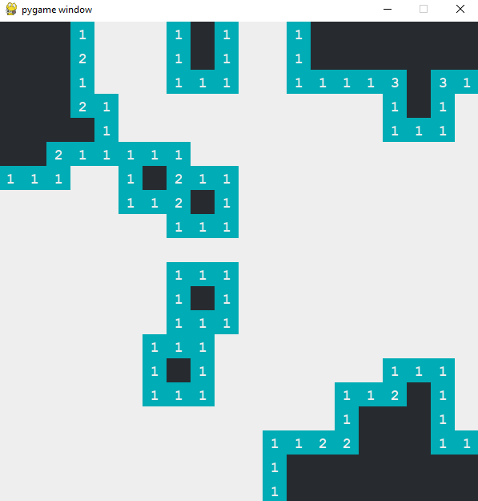
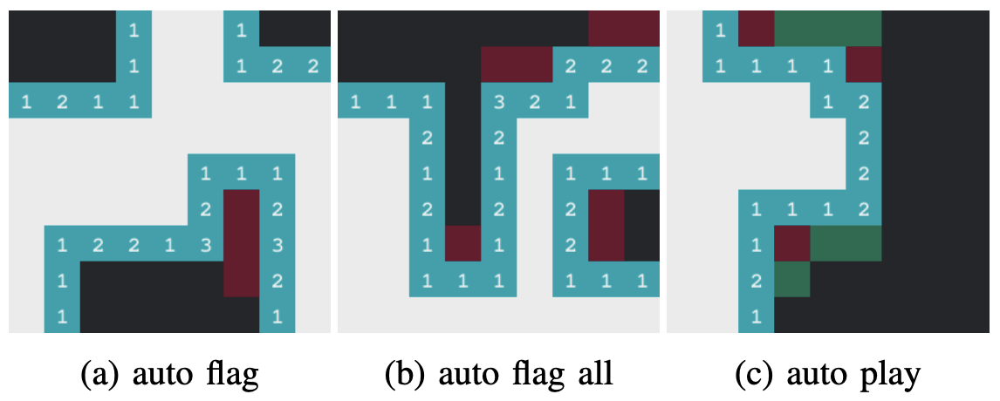
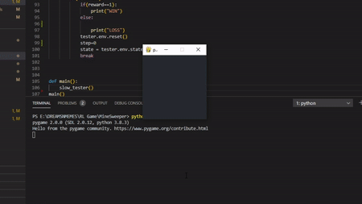
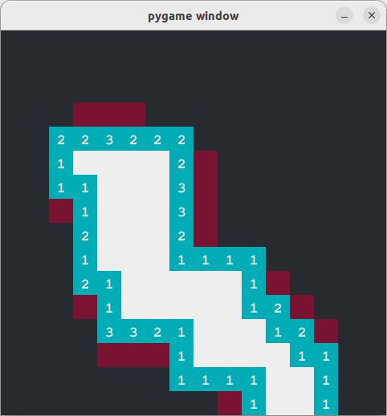
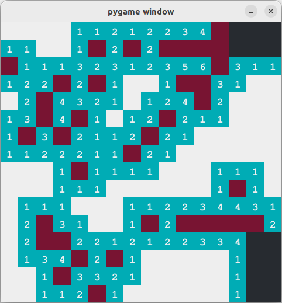

# INF581-2023 Course Project

# Introduction

This a project on the topic of *Reinforcement Learning (RL)* for 
the course **INF581-2023** at Ecole Polytechnique. Its objective 
is to train Autonomous Agents that can play automatically 
the **Minesweeper** game of different difficulty levels with 
a decent winning rate. 

Playable version of 20x20 grid with 20 mines 

## Contents

As for the first release, this package contains only the testing scripts, trained weights and
model files. The training scripts, intermediate weights and logs are not provided. Below is a 
brief overview of our model list.

    /Example      # figures and media
    /Models       # Model files 
    /pre-trained  # pretrained model weights

    requirements.txt
    game.py           # game env
    renderer.py       # game renderer 
    playable.py       # clickable GUI
    tester_hybrid.py  # (Deterministic +) AI tester

# Quick Start

##  1. Environment setup
    pip install -r requirements.txt

## 2. Test the Playable Game
    python playable.py
A blank GUI interface will pop up for you to click on and play with.
The game mode is set to `win7`, which plants bombs after your first click.
You can find the game mode defined in the file here:

    if __name__ == "__main__":
        rule = "winxp"        # "default" "winxp"
        auto_flag = False     # mark MUST-BE mines in red
        auto_play = False     # auto play whenever there's a mine-free click

The `default` game mode plant the bombs before the GUI pops up 
so that you might lose at your first click. Check the Changelog 
at the end of this file for more details on the game modes 

If `auto_flag` is set to `True`, then the game will mark the grids 
that must be mines (based on your previous clicks) with red to prevent you from tedious calculations.

`auto_play` will automatically open the grids that are mine-free based on your previous clicks.

## 3. Test our Autonomous Agents !

Now you've been familiar with the game environment, let's try the autonomous agents.

### 3.1 Hybrid Tester
    python tester_hybrid.py

You can test different trained models and game mode by specifying the Configurable Parameters below.
Available model names are `DQN`, `DDQN`, `DDQNCNN`, `DDQNCNNL`, `PPO`. 

    if __name__ == "__main__":

        # === configurable parameters ===
    
        model_type = "DDQNCNNL"   # model type
        test_rule = 'win7'        # game mode
        test_simulation_no = 10000 
        nb_cuda = -1              # -1 = cpu; else specify cuda device: ex. 0 = cuda:0
        render_flag = True        # GUI
        hybrid = True             # AI + deterministic solver
        
        # === Do not modify the contents below ===

#### 3.1.1 Results for  `render_flag == False`:

| Model      | Game mode | Hybrid | Win Rate %  | Intervention % | Intervention Win Rate % |
|------------|-----------|--------|-------------|----------------|-------------------------|
| STOCHASTIC | Default   | True   | 60.12       | 68.02          | 58.74                   |
| DQN        | Default   | True   | 62.28       | 74.63          | 71.84                   |
| DDQN       | Default   | True   | 65.56       | 74.42          | 76.11                   |
| DDQNCNNL   | Default   | True   | 66.99       | 62.7           | 67.4                    |
| STOCHASTIC | WinXP     | True   | 68.2        | 76.96          | 58.67                   |
| DQN        | WinXP     | True   | 67.39       | 90.14          | 63.82                   |
| DDQN       | WinXP     | True   | 72.54       | 90.31          | 69.59                   |
| DDQNCNNL   | WinXP     | True   | 79.03       | 69.27          | 69.72                   |
| STOCHASTIC | Win7      | True   | 80.44       | 41.65          | 53.03                   |
| DQN        | Win7      | True   | 73.11       | 74.52          | 63.92                   | 
| DDQN       | Win7      | True   | 79.35       | 74.14          | 72.14                   | 
| DDQNCNNL   | Win7      | True   | 84.66       | 53.29          | 71.21                   |
| STOCHASTIC | Default   | False  | 0           | 87.64          | 0                       |
| DQN        | Default   | False  | 51.99       | 82.65          | 62.87                   |
| DDQN       | Default   | False  | 59.19       | 83.31          | 71.04                   |
| DDQNCNNL   | Default   | False  | 25.86       | 87.74          | 29.47                   |
| STOCHASTIC | WinXP     | False  | 0.03        | 100            | 0.03                    |
| DQN        | WinXP     | False  | 49.78       | 99.98          | 49.76                   |
| DDQN       | WinXP     | False  | 58.58       | 99.99          | 58.58                   |
| DDQNCNNL   | WinXP     | False  | 32.98       | 100            | 32.98                   |
| STOCHASTIC | Win7      | False  | 0.01        | 100            | 0.01                    |
| DQN        | Win7      | False  | 44.62       | 99.96          | 44.60                   |
| DDQN       | Win7      | False  | 55.12       | 99.95          | 55.09                   | 
| DDQNCNNL   | Win7      | False  | 38.91       | 100            | 38.91                   |

`Intervention %` signifies the proportion of the games where the deterministic solver was not sure about
its decision and AI intervened. 

For `hybrid == True`, it's the `Intervention Win Rate` that we should care about. As for `hybrid == True`,
games are purely played by AI, thus the `Win Rate` should be equal to `Intervention Win Rate`. 

#### 3.1.2 Preview for `render_flag == True`:

white = zeros 
dark gray = unexplored 
<b> Note:</b> The game has been slowed down to do 2 decisions every 1 second 

---

# Changelog ---

### - 02.20 

- **Definite player added in tester**

`use_definite` state is now added when creating the win tester to show the performance.  

By setting `use_definite=True` the agent will choose a grid that is sure not to contain a miner as the action. Otherwise, the RL agent will be used to generate the action. 

It seems that in most cases, better results can be obtained by using a deterministic approach. 

### - 02.20

- **Auto Flag added**

`flagged` state is now added, with value `-2` in the `state` array of `MineSweeper`.  

By setting `auto_flag=True` every time calling `choose()` function of `MineSweeper`, cells containing bomb with a 100% probability are automatically flagged and marked in purple. 

**Attention!** You may need to deal with the new possible value `-2` before feeding the `state` array to pretrained models. 

Below is an example on medium difficulty grid, after only one click:  

- **Auto Play added**

Now the MineSweeper is able to play automatically by choosing one masked cell with a 0% probability of containing a bomb and *repeat until* no more cell satisfies this condition. 

Just set `auto_play=True` every time calling `choose()` function of `MineSweeper`.

Below is an example on medium difficulty grid, after only one click: 

**Try it out and have fun!** Just run `playable.py` to discover the auto-play functionality.

Example of usage: `next_state, terminal, reward = env.choose(i, j, auto_flag=True, auto_play=True)`

Reminder: both `auto_flag` and `auto_play` take slightly more time to compute compare to the original `choose` function. 

### - 02.18

**More realistic rule sets are now added!** 

Instead of stupid initialization of bomb locations while reset, we've added two more possible rule set: 

- Windows XP rule set: the bomb is never located at the square of the first click (rules out 1 square)
- Windows 7 rule set: the bomb is never located at nor around the square of the first click (rules out 9 squares) 

In order to use new rule sets in your code, simply add one more parameter `rule` every time creating new instances of the `MinsSweeper()` class from `game.py`. 

Possible keywords are `default` (stupid initialization), `winxp` (Windows XP rule set) and `win7` (Windows 7 rule set). 

For example, `env = MineSweeper(width=10, height=10, bomb_no=9, rule='win7')`.

|difficulty|Windows XP rule|Windows 7 rule|
|---|---|---|
|easy (9*9 grid, 10 bombs)|91.63%|97.05%|
|medium (16*16 grid, 40 bombs)|78.04%|89.11%|
|hard (16*30 grid, 99 bombs)|40.07%|52.98%|

c.f. https://github.com/ztxz16/Mine
